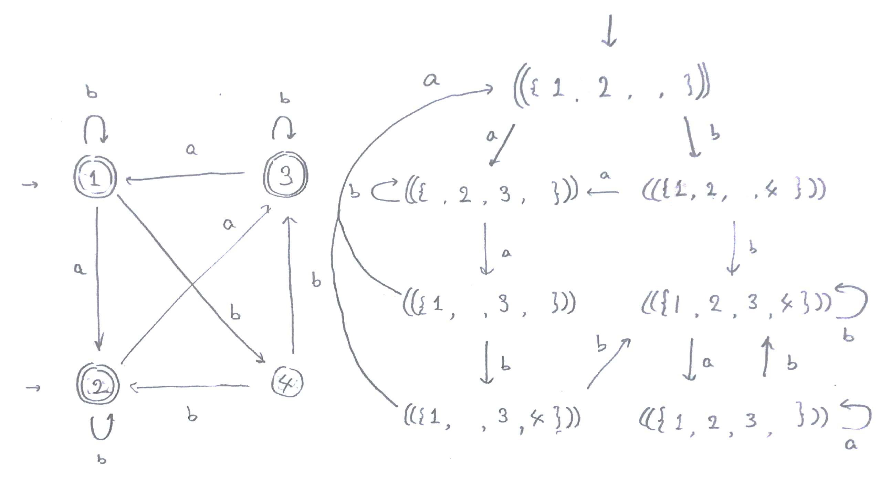

####################################################################
Alternating Finite Automata for Deciding Presburger Arithmetic
####################################################################

:Authors: - Kei Shirakizawa (JAIST)

.. role:: raw(raw)
   :format: latex

.. default-role:: math

.. Copy & Paste Work
   docs/notebook/src/i513/trs_48.org
   docs/notebook/src/i513/tseitin.org
   externalfile:drive-f17f12fadca928148afe7b3620738e10fd62afc6/root/misc/0822_dentrance_exam.pdf

Introduction
=============================

Automata-based Decision Procedure for Presburger Arithmetic
--------------------------------------------------------------------

SAT Problem
  (in Presburger Arithmetic) : Given a FOL formula  `\varphi`, answers `(\mathbb{N}; + ; =) \models \varphi` or not.

Procedure
  (Boudet, Comon)

   Construct the automaton \( \mathcal{A}_\varphi \) serving as the interpreter of \( \varphi \), .i.e, \( \mathcal{L}(\mathcal{A}_\varphi) \) contains all the solutions of \( \varphi \).

   - `\mathcal{A}_{\varphi}` accepts the solution of an atomic formula \( \varphi \).
   - `\mathcal{A}_{\varphi_1 \wedge \varphi_2}` accepts \( \mathcal{L}(\mathcal{A}_{\varphi_1}) \cap \mathcal{L}(\mathcal{A}_{\varphi_2}) \).
   - `\mathcal{A}_{\varphi_1 \vee \varphi_2}` accepts \( \mathcal{L}(\mathcal{A}_{\varphi_1}) \cup \mathcal{L}(\mathcal{A}_{\varphi_2}) \).
   - `\mathcal{A}_{\neg \varphi}` accepts the complement of \( \mathcal{L}(\mathcal{A}_{\varphi}) \).
   - `\mathcal{A}_{\exists x_i .\ \varphi}` accepts the \( i \)-th projection of \( \mathcal{L}(\mathcal{A}_{\varphi}) \).

.. raw:: latex

   \begin{theorem}[Boudet, Comon]
       The automaton algorithm decides Presburger arithmetic in triple 
       exponential time.
   \end{theorem}

Optimized Methods for Automata-based Decision Procedure
--------------------------------------------------------------------
:raw:`\todo{Introduce Antichain and Bisimulation}`

.. admonition:: Background

   TODO

.. admonition:: Antichain algorithm (Wulf et al.)

   TODO

.. admonition:: Bisimulation up to congruenceo (Bonchi, Pous)

   TODO

Topics
-----------------------------

Problem
  SAT checking of Presburger Arithmetic

Procedure
  Automata construction followed by emptiness checking

Limitation
  EXPTIME-COMPLETE

Aim
  Optimize the decision procedure

.. admonition:: Optimization techniques

   - **Antichain Algorithm**: Language universality
   - **Bisimulation up to Congruence**: Language equality

.. admonition:: Contribution

   - Alternating Finite Automaton (AFA)
   - SAT encoding

Related Works
-----------------------------
:raw:`\todo{Collect works on automatic structure, optimization, 
decision procedures}`

.. admonition:: So-called Automatic Structure

   WS1S is a logic with a model

.. admonition:: Optimization Techniques

   Nested Antichain for WS1S

.. admonition:: Decision Procedures

   Coalgebraic approach

Preliminaries
=============================

Presburger Arithmetic
-----------------------------
:raw:`\todo{Define PA}`  

.. Comment `\forall x \ldotp` and `\exists y \ldotp`.

.. raw:: latex

  \begin{example}[Presburger Arithmetic]
       \todo{Show example}
  \end{example}

Finite Automata
-----------------------------
:raw:`\todo{Define FA}`  

.. raw:: latex

   \begin{definition}[NFA]
       \todo{Define NFA}
   \end{definition}

   \begin{example}[NFA]
       \todo{Show example}
   \end{example}

Automata-based Decision Procedure for Presburger Arithmetic
--------------------------------------------------------------------
:raw:`\todo{Explain/demonstrate Boudet Comon}`

.. admonition:: Boudet Common

   Automata onstruction

Projection for Existential Quantifier
--------------------------------------------------------------------
:raw:`\todo{Explain/demonstrate homomorphism and projection}`

.. raw:: latex

   \begin{theorem}[Closed under homomorphism]
     A regular language is closed under homomorphism.
   \end{theorem}

Optimization Techniques
=============================

Antichain Algorithm
-----------------------------

.. raw:: latex

   \( \{1, 2, 3,\ \}, \{1, \ , 3, 4 \} and \{1, 2, 3, 4\} \)

Bisimulation up to Congruence
-----------------------------

.. raw:: latex

   \( \{1, \ , 3,\ \}, \{1, 2, 3,\ \}, \{1, \ , 3, 4 \} and \{1, 2, 3, 
   4\} \)

AFA-based Decision Procedure
=====================================================================

Alternating Finite Automaton
--------------------------------------------------------------------
:raw:`\todo{Define AFA and explain/demonstrate NFA equivalence.}`

NFA to AFA Translation
-----------------------------
:raw:`\todo{Explain/demonstrate AFA translation.}`

AC in AFA
-----------------------------
:raw:`\todo{Explain/demonstrate AC in AFA setting}`

.. raw:: latex

   \( 
       \alpha \equiv q_0[\delta(q_0, a)/q_0, \ldots \delta(q_n, a)/q_n]
   \)
   \( \alpha \Rightarrow \beta \)

BC in AFA
-----------------------------
:raw:`\todo{Explain/demonstrate BC in AFA setting}`

.. raw:: latex

   \( 
       \alpha \equiv q_0[\delta(q_0, a)/q_0, \ldots \delta(q_n, a)/q_n]
   \)
   \( \alpha \vee \gamma \Rightarrow \beta \)

AFA-based Optimization Method
--------------------------------------------------------------------
:raw:`\todo{Define the procedure}`

Example (AFA-based Optimization Method)
--------------------------------------------------------------------
:raw:`\todo{Exemplify AFA-based Optimization Method}`

SAT Encoding
-----------------------------
:raw:`\todo{Explain/demonstrate SAT encoding}`

Example (SAT Encoding)
-----------------------------
:raw:`\todo{Exemplify SAT encoding}`

Conclusion 
=============================

Conclusion
-----------------------------
:raw:`\todo{Conclude contribution of this work}`

Problem
  Check `\varphi \models \mathit{PA}`

Procedure
  #. DFA -> AFA
  #. Enumerate AFA's reachable state minimizing it
  #. Ordering -> CNF and feed it to SAT solver

.. admonition:: Comparison of techniques

   - Antichain Algorithm: Check `L(A) = \Sigma^*`
   - Bisimulation up to Congruence: `L(A) = L(B)`
   - **AFA-based technique**: `L(A) = \varnothing`

Future work
-----------------------------
:raw:`\todo{Enumerate further direction of this work}`

.. admonition:: So-called Automatic Structure

   WS1S is a logic with a model

.. admonition:: Optimization Techniques

   Nested Antichain for WS1S

.. admonition:: Decision Procedures

   Coalgebraic approach
